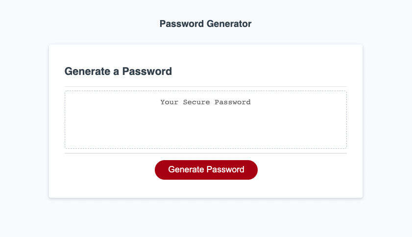

# Password Generator

Here's what the code does:

Index.html houses the main structure of the page. Style.css handles the styling (Style sheets for other color ways may be introduced in the future). Script.js works to magic and takes in a few prompts to generate a password.

There are a few things working behind the scenes past that to add some validation -- here's the gist:

- The length of the password needs to be between 8 - 128 characters
- User's must opt to include at least one type of characters, picking from lowercase, Uppercase, numeric, and special characters
- If they don't chose "y" or "Y" to any of those, they have to try again.

View the site here: <https://makeithappenmike.github.io/password-generator/>

Contributions by Michael Martens

Screenshot:

